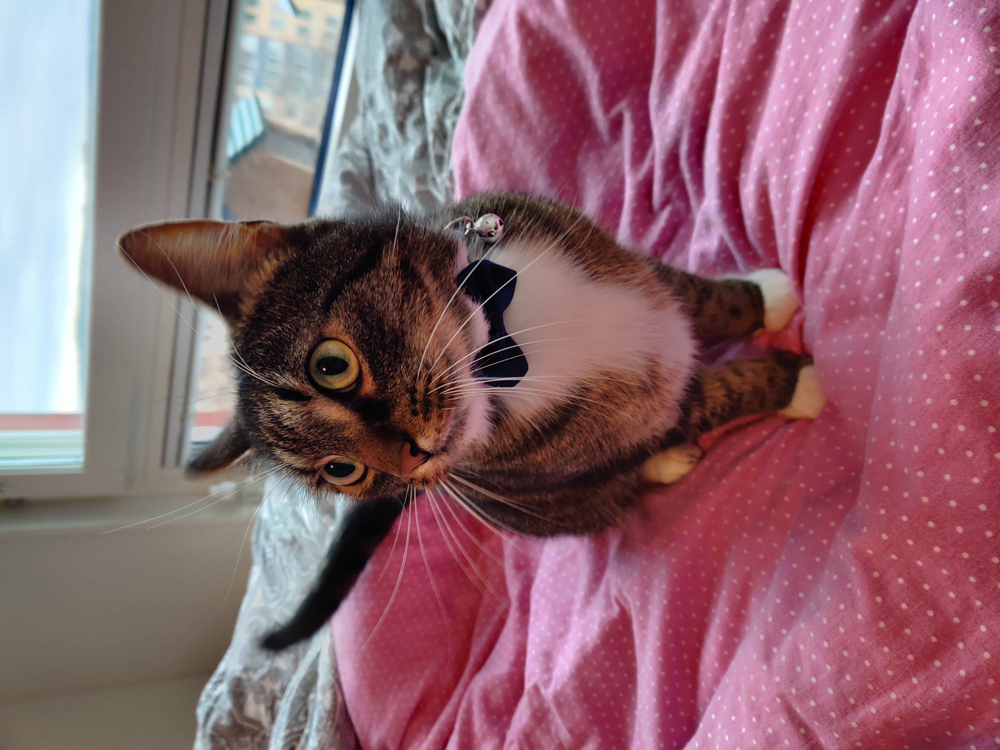

  
 

---

👋 I'm Eric, and this is my cat, Berlioz. &#128570;

🔭 I’m a MSc student in Physics, currently doing my Master's Thesis in applying Graph Neural Networks in Neuroscience &#129504;

#### GitHub Stats
---

  
  

<!--
**elindgren/elindgren** is a ✨ _special_ ✨ repository because its `README.md` (this file) appears on your GitHub profile.

Here are some ideas to get you started:

- 🔭 I’m currently working on ...
- 🌱 I’m currently learning ...
- 👯 I’m looking to collaborate on ...
- 🤔 I’m looking for help with ...
- 💬 Ask me about ...
- 📫 How to reach me: ...
- 😄 Pronouns: ...
- ⚡ Fun fact: ...
-->
